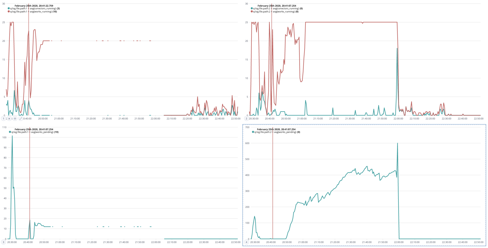

# Elastic stack to analyze Bonita logs 


This project contains a preconfigured Logstash pipeline that parses a set of logs from bonita and put them in elastic search


## Configuration

Configure the path to the logs in `.env` file

## Usage

* Start : `docker-compose up -d --build`
* Show logs : `docker-compose logs -f`
* Stop(remove): `docker-compose down`

Once started, configure Kibana indexes.


### Timelion example queries


```
.es(index=log-monitoring-*, metric=avg:conectors_running,  q="log.file.path:1"),
.es(index=log-monitoring-*, metric=avg:works_running,  q="log.file.path:1")
```

Will produce something like following




Other queries

```
.es(q="work_submission.keyword:Tried AND log.file.path:1"),
.es(q="work_submission.keyword:Submitted AND log.file.path:1"),
.es(q="work_submission.keyword:Completed AND log.file.path:1")


.es(metric=avg:works_pending,  q="log.file.path:1")

.es(q="log_content:Ignoring\ couple AND log.file.path:1")
```
